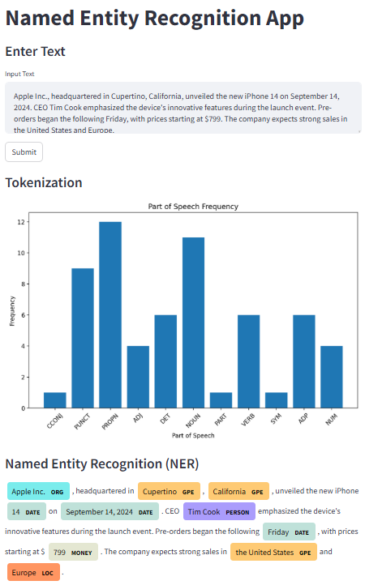

# NLP_Name_Detector

This repository contains a Streamlit web application for Named Entity Recognition (NER) using spaCy. The application allows users to input text, visualize tokenization and part-of-speech tagging, and view named entity recognition results.

## NLP Aspects

This repository focuses on the following natural language processing (NLP) aspects:

- **Named Entity Recognition (NER):** The core feature of this application is to identify and highlight named entities in text data. It utilizes the spaCy library for accurate NER.
- **Tokenization:** The app demonstrates tokenization, the process of splitting text into individual words or tokens, which is a fundamental step in many NLP tasks.
- **Part-of-Speech Tagging (POS):** It also provides insights into the part-of-speech tagging of tokens, helping users understand the grammatical structure of the input text.
- **Customizable:** You can easily adapt and extend this application to handle various NLP tasks and experiment with different spaCy models and techniques.

## Demo

<p align="center">
  
</p>


## How to Install/Setup

1. **Create a Conda Environment:**
   - Create a new Conda environment named `nlp` with Python 3.11:
     ```bash
     conda create -n nlp python=3.11
     ```

2. **Activate the Environment:**
   - Activate the newly created environment:
     ```bash
     conda activate nlp
     ```

3. **Install Dependencies:**
   - Install the required packages:
     ```bash
     pip install -r requirements.txt
     ```

4. **Restart the Environment:**
   - Restart your terminal or re-activate the environment to ensure all dependencies are properly loaded.

## How to Run

1. **Navigate to the Cloned Directory:**
   - Change to the directory where the repository is cloned:
     ```bash
     cd path/to/NLP_Name_Detector
     ```

2. **Activate the Conda Environment:**
   - Ensure that the `nlp` environment is activated:
     ```bash
     conda activate nlp
     ```

3. **Launch the Web Application:**
   - Start the Streamlit app by running:
     ```bash
     streamlit run maincode.py
     ```

4. **Access the Web App:**
   - The web application should automatically open in your default browser. If it does not, manually open your browser and navigate to:
     - **Local URL:** [http://localhost:8501](http://localhost:8501)
     - **Network URL:** [http://10.10.19.182:8501](http://10.10.19.182:8501)
